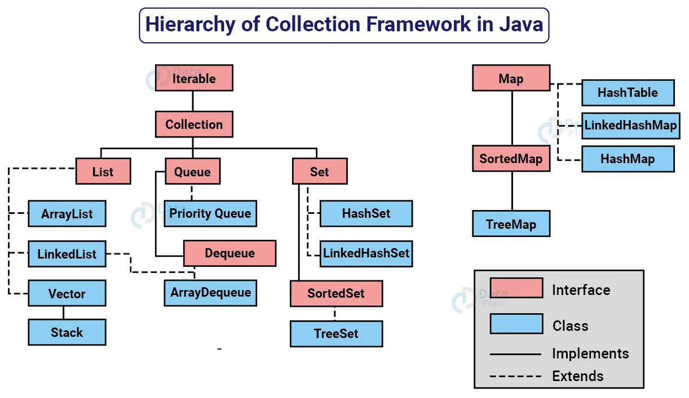
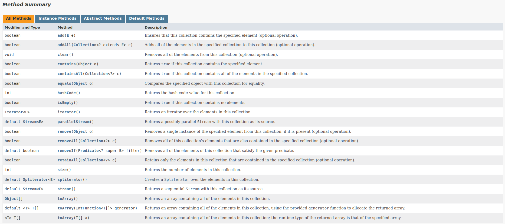

# Collection Framework API

- Uma coleção (collection) é uma estrutura de dados que serve para agrupar muitos elementos em uma única unidade, estes elementos precisão ser Objetos.
- Uma Collection pode ter coleções homogêneas e heterogêneas, normalmente utilizamos coleções homogêneas de um tipo especifico.
- O núcleo principal das coleções é formado pelas interfaces da figura a abaixo, essas interfaces permitem manipular a coleção independente do nível de detalhe que elas representam.
- Temos quatro grandes tipos de coleções: `List` (lista), `Set` (conjunto), `Queue` (fila) e `Map` (mapa), a partir dessas interfaces, temos muitas subclasses concretas que implementam varias formas diferentes de se trabalhar com cada coleção.

<p align="center">
<br>
<a href="https://data-flair.training/blogs/collection-framework-in-java/">Hierarchy of Collection Framework in Java </a>
</p>


- Todas as interfaces e classes são encontradas dentro do pacote (package) `java.util`.
- Embora a interface `Map` não ser filha direta da interface `Collection` ela também é considerada uma coleção devido a sua função.

<p align="center">
<br>
<a href="https://docs.oracle.com/en/java/javase/17/docs/api/java.base/java/util/Collection.html">Method Sumary Collection Interface</a>
</p>


---

### Referências:

[1] "Java Collections - Universidade Java." Universidade Java. Disponível em: http://www.universidadejava.com.br/java/java-collection/.

[2] "Java™ Platform, Standard Edition 17 API Specification - Interface Collection." Oracle. Disponível em: https://docs.oracle.com/en/java/javase/17/docs/api/java.base/java/util/Collection.html.

[3] "Java Comparator and Comparable - Baeldung." Baeldung. Disponível em: https://www.baeldung.com/java-comparator-comparable.

[4] "Java™ Platform, Standard Edition 17 API Specification - Class Collections." Oracle. Disponível em: https://docs.oracle.com/en/java/javase/17/docs/api/java.base/java/util/Collections.html.

---
Se você preferir usar o protocolo SSH para comunicação com o repositório, siga as etapas abaixo:

1. Abra o terminal ou prompt de comando.

2. Navegue até o diretório do projeto.

3. Execute o seguinte comando para mudar a URL remota para SSH:

   ```shell
   git remote set-url origin git@github.com:cami-la/collections-java-api-2023.git

### Dúvidas e Suporte

Caso você tenha alguma dúvida, problema ou sugestão, fique à vontade para abrir uma issue no repositório. Espero conseguir te ajudar! (:
