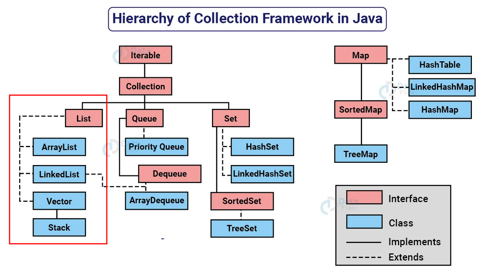

# List Interface

 
<a href="https://data-flair.training/blogs/collection-framework-in-java/">Hierarchy of Collection Framework in Java </a>

- A interface <code>List</code> é uma coleção ordenada que permite a inclusão de elementos duplicados.
- É um dos tipos de coleção mais utilizados em Java, e as classes de implementação comuns são <code>ArrayList</code> e <code>LinkedList</code>.
- A <code>List</code> se assemelha a uma matriz com comprimento dinâmico, permitindo adicionar ou remover elementos.
- A interface <code>List</code> fornece métodos úteis para adicionar elementos em posições específicas, remover ou substituir elementos com base no índice e obter sublistas usando índices.
- A classe <code>Collections</code> fornece algoritmos úteis para manipulação de <code>List</code>, como ordenação (sort), embaralhamento (shuffle), reversão (reverse) e busca binária (binarySearch).

> ##### *ArrayList*: O ArrayList é uma implementação da interface List que armazena os elementos em uma estrutura de array redimensionável. Isso significa que ele pode crescer automaticamente à medida que novos elementos são adicionados. A principal vantagem do ArrayList é o acesso rápido aos elementos por meio de índices, o que permite recuperar um elemento específico de forma eficiente. No entanto, adicionar ou remover elementos no meio da lista pode ser mais lento, pois requer a realocação de elementos.

> ##### *LinkedList*: O LinkedList é uma implementação da interface List que armazena os elementos em uma lista duplamente vinculada. Cada elemento contém referências para o elemento anterior e próximo na lista. A principal vantagem do LinkedList é a eficiência na adição ou remoção de elementos no início ou no final da lista, pois não é necessário realocar elementos. No entanto, o acesso aos elementos por meio de índices é mais lento, pois requer percorrer a lista até o elemento desejado.

> ##### *Vector*: O Vector é uma implementação antiga da interface List que é semelhante ao ArrayList, mas é sincronizada, ou seja, é thread-safe. Isso significa que várias threads podem manipular um objeto Vector ao mesmo tempo sem causar problemas de concorrência. No entanto, essa sincronização adiciona uma sobrecarga de desempenho, tornando o Vector menos eficiente do que o ArrayList em cenários em que a concorrência não é um problema. Por esse motivo, o uso do Vector é menos comum em aplicações modernas.

### Referências:

[1] "Collections in Java Tutorial." DigitalOcean Community. Disponível em: https://www.digitalocean.com/community/tutorials/collections-in-java-tutorial.

[2] "Java™ Platform, Standard Edition 17 API Specification - Class List." Oracle. Disponível em: https://docs.oracle.com/en/java/javase/17/docs/api/java.base/java/util/List.html.

# Fixando os Conhecimentos

Exercícios:

1. Operações Básicas com List
2. Pesquisa em List
3. Ordenação nas List

## Operações Básicas com List

### 1. Lista de Tarefas

Crie uma classe chamada "ListaTarefas" que possui uma lista de tarefas como atributo. Cada tarefa é representada por uma classe chamada "Tarefa" que possui um atributo de descrição. Implemente os seguintes métodos:

- `adicionarTarefa(String descricao)`: Adiciona uma nova tarefa à lista com a descrição fornecida.
- `removerTarefa(String descricao)`: Remove uma tarefa da lista com base em sua descrição.
- `obterNumeroTotalTarefas()`: Retorna o número total de tarefas na lista.
- `obterDescricoesTarefas()`: Retorna uma lista contendo a descrição de todas as tarefas na lista.

### 2. Carrinho de Compras:

Crie uma classe chamada "CarrinhoDeCompras" que representa um carrinho de compras online. O carrinho deve ser implementado como uma lista de itens. Cada item é representado por uma classe chamada "Item" que possui atributos como nome, preço e quantidade. Implemente os seguintes métodos:

- `adicionarItem(String nome, double preco, int quantidade)`: Adiciona um item ao carrinho com o nome, preço e quantidade especificados.
- `removerItem(String nome)`: Remove um item do carrinho com base no seu nome.
- `calcularValorTotal()`: Calcula e retorna o valor total do carrinho, levando em consideração o preço e a quantidade de cada item.
- `exibirItens()`: Exibe todos os itens presentes no carrinho, mostrando seus nomes, preços e quantidades.

----

## Pesquisa em List

### 1. Catálogo de Livros

Crie uma classe chamada "CatalogoLivros" que possui uma lista de objetos do tipo "Livro" como atributo. Cada livro possui atributos como título, autor e ano de publicação. Implemente os seguintes métodos:

- `adicionarLivro(String titulo, String autor, int anoPublicacao)`: Adiciona um livro ao catálogo.
- `pesquisarPorAutor(String autor)`: Pesquisa livros por autor e retorna uma lista com os livros encontrados.
- `pesquisarPorIntervaloAnos(int anoInicial, int anoFinal)`: Pesquisa livros publicados em um determinado intervalo de anos e retorna uma lista com os livros encontrados.
- `pesquisarPorTitulo(String titulo)`: Pesquisa livros por título e retorna o primeiro livro encontrado.

### 2. Soma de Números

Crie uma classe chamada "SomaNumeros" que possui uma lista de números inteiros como atributo. Implemente os seguintes métodos:

- `adicionarNumero(int numero)`: Adiciona um número à lista de números.
- `calcularSoma()`: Calcula a soma de todos os números na lista e retorna o resultado.
- `encontrarMaiorNumero()`: Encontra o maior número na lista e retorna o valor.
- `encontrarMenorNumero()`: Encontra o menor número na lista e retorna o valor.
- `exibirNumeros()`: Retorna uma lista contendo todos os números presentes na lista.

-------

## Ordenação em List

### 1. Ordenação de Pessoas

Crie uma classe chamada "OrdenacaoPessoas" que possui uma lista de objetos do tipo "Pessoa" como atributo. Cada pessoa possui atributos como nome, idade e altura. Implemente os seguintes métodos:

- `adicionarPessoa(String nome, int idade, double altura)`: Adiciona uma pessoa à lista.
- `ordenarPorIdade()`: Ordena as pessoas da lista por idade usando a interface Comparable.
- `ordenarPorAltura()`: Ordena as pessoas da lista por altura usando um Comparator personalizado.

### 2. Ordenação de Números

Crie uma classe chamada "OrdenacaoNumeros" que possui uma lista de números inteiros como atributo. Implemente os seguintes métodos:

- `adicionarNumero(int numero)`: Adiciona um número à lista.
- `ordenarAscendente()`: Ordena os números da lista em ordem ascendente usando a interface Comparable e a class Collections.
- `ordenarDescendente()`: Ordena os números da lista em ordem descendente usando um Comparable e a class Collections.

---
### Dúvidas e Suporte

Caso você tenha alguma dúvida, problema ou sugestão, fique à vontade para abrir uma issue no repositório. Espero conseguir te ajudar! (:
